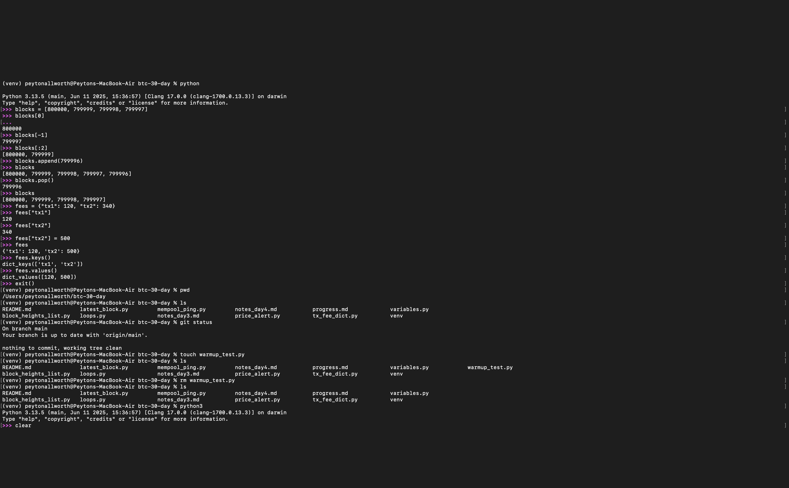
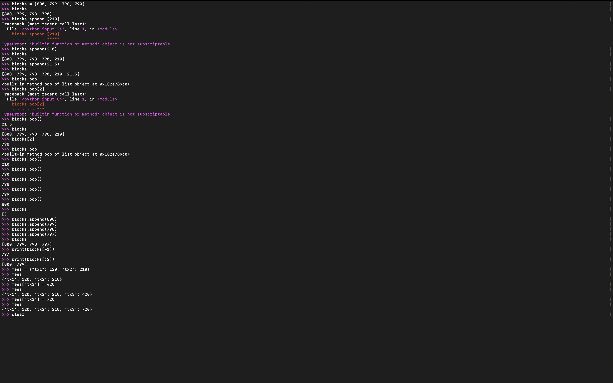

### Day 3 Python Sprint

- I practiced variables, input(), type conversion, and some math.
- Built a BTC-to-USD calculator using satoshis.
- Debugged errors around casting, undefined variables, and formatted the output.
- Used string interpolation and basic if-statements (including a little trolling my brother).

#### Concepts and Terms

- **Variable** – A name that stores a value in memory (e.g. `age = 24`)
- **Input** – Grabs user input as a string (`input("Enter something: ")`)
- **Type casting** – Converting one type to another (e.g. `int("25")`)
- **String interpolation** – Inserting variables into strings with `f"{var} text"`
- **Arithmetic operators** – `+`, `-`, `*`, `/` for math with numbers
- **Float formatting** – Controlling decimal output (`{value:.2f}`)
- **Error: NameError** – When you use a variable that hasn't been defined yet
- **Error: ValueError** – When a string can’t be converted to an int (e.g. `int("ten")`)
- **Conditionals** – Using `if` to run code only when something is true

Day 4 – Practiced loops with CS50P Lecture 1; built sum_even.py to reinforce syntax

Day 5 – Day 5.2 – Official sprint task: fetched and printed mempool JSON using requests; tested API error handling; locked in venv + requests setup

---------------------
# ( Experimental: Alert builder
Built BTC alert tool using Strike API; sends email to friends if price below threshold of 100k 
# Experimental: Alert builder)

Day 6 – Added CLI flags (--raw, --send) to BTC alert tool; cleaned output & tested safe email logic

Day 7 reflection - Was a patchy start. busy with moving a vacation and other projects and work. However it was a good introduction week and ive learned enough to see where things are headed. Spent the day learning some python on Quibble!

Day 8 step 1 -

Day 8 step 2 - First I Learned how to fetch and print raw Bitcoin transaction data from mempool.space.

Day 9 warm up - Practiced terminal drills (pwd, ls, touch, rm) to build CLI muscle memory.  
- Jumped into Python REPL and drilled lists (append, pop, slicing) and dictionaries (adding keys, viewing keys/values).  
- Learned how to add a new key to a dictionary and understood how .pop() affects lists.  
- Reflected on the difference between list indexing vs. dictionary keys.  

### Screenshots

Day 9 Practicing old projects from muscle memory and then pushing to new limits with AI tools

- I started today’s session coding without Cursor to make sure I was thinking through the logic myself and reinforcing the fundamentals. Once I had a working baseline, I used Cursor as a creative accelerator to help me push my script further and explore more complex comparisons (like fee rate analysis across blocks). I’m mindful not to lean on it too much; I try to write as much as I can independently, using Cursor only to stretch what I’m building rather than shortcutting the learning. Its always cool to let myself use AI tools and build for speed, I really get to accomplish more of what I can imagine then be limited by my coding bottleneck. 